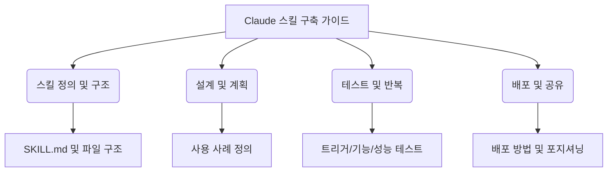

==이 자료는 Claude를 특정 작업이나 워크플로우에 맞게 맞춤 설정하고 일관되게 사용하도록 가르치는 '스킬'의 구축, 테스트, 배포에 대한 포괄적인 안내서입니다.== 스킬은 반복적인 작업을 자동화하고 전문 지식을 내재화하여 Claude의 기능을 사용자 정의하는 강력한 방법입니다.

  

  

## 1. Claude 스킬의 정의와 구조

- **스킬**은 특정 작업을 가르치는 **명령 집합**   
    
- 스킬은 **폴더** 형태로 패키징되어 배포됨   
    
- **SKILL.md**는 필수이며, **YAML 프론트매터** 포함됨   
    
- **점진적 공개**로 토큰 사용 최소화 가능   
    
- 스킬은 **독립적**으로 작동하며 다른 스킬과 **호환**되어야 함   
    
- ==스킬은 반복 작업 자동화에 강력함==   
    

  

## 2. 스킬 설계 및 핵심 원칙

- 코딩 전 **2~3개 구체적 사용 사례** 정의 필수   
    
- 사용 사례는 **목표, 단계, 필요한 도구**를 포함해야 함   
    
- **문서/자산 생성, 워크플로우 자동화, MCP 강화**가 주요 카테고리임   
    
- **성공 기준**은 정량적/정성적 지표로 정의해야 함   
    
- **YAML 프론트매터**는 스킬 로딩 여부를 결정하는 핵심 요소임   
    
- **설명 필드**는 **무엇을 하는지**와 **언제 사용**할지를 명시해야 함   
    

  

## 3. 스킬 테스트 및 반복 전략

- **수동, 스크립트, API** 등 다양한 수준의 테스트 필요   
    
- **단일 작업**에 집중하여 성공 시 확장하는 것이 효과적임   
    
- **트리거 테스트**로 로딩 시점 정확성 검증이 중요함   
    
- **기능 테스트**로 정확한 출력 및 오류 처리 확인 필요   
    
- **성능 비교**로 스킬 사용 전후의 효율성 입증해야 함   
    
- **피드백 기반 반복**으로 언더/오버 트리거링 해결 가능   
    

  

## 4. 배포 및 포지셔닝

- 스킬은 **Claude.ai** 또는 **API**를 통해 배포 가능   
    
- **GitHub 호스팅** 후 **MCP 문서**에 연결하는 것이 권장됨   
    
- 스킬 설명 시 **결과(Outcome)**에 초점 맞춰야 함   
    
- **MCP + 스킬**의 시너지를 강조해야 가치 전달이 쉬움   
    
- 스킬은 **오픈 표준**으로 다른 플랫폼에서도 이식 가능함   
    

  

## 5. 일반적인 패턴 및 문제 해결

- **순차적 워크플로우**는 명확한 단계 순서가 중요함   
    
- **다중 MCP 조정**은 단계별 데이터 전달이 핵심임   
    
- **반복적 개선**은 명시적 품질 기준을 요구함   
    
- **SKILL.md**에 **스크립트**를 활용하면 검증이 더 확실함   
    
- **SKILL.md 크기 최적화**로 대규모 컨텍스트 문제 방지   
    
- **잘못된 이름/포맷**은 업로드 실패의 주원인임